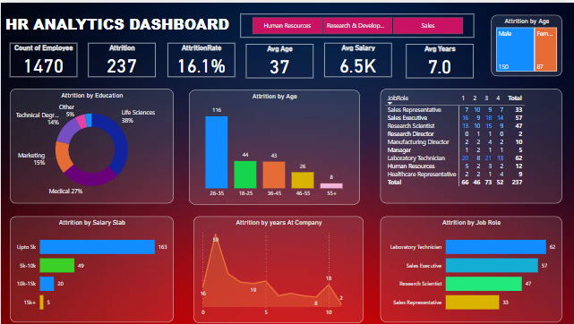

# HR Analytics Dashboard

A Power BI dashboard to visualize and analyze HR data with a focus on attrition, employee demographics, and department performance.

---

## Dashboard Preview

---

##  Project Overview

This project analyzes an HR dataset to extract meaningful insights around attrition, diversity, and workforce trends. It supports HR teams in making data-driven decisions.

---

##  Key Insights

- **Employees Analyzed:** 1470
- **Attrition Rate:** 16.12%
- **Average Age:** 37
- **Average Salary:** 6.5K
- **Top Attrition Age Group:** 26–35
- **Job Roles with Highest Attrition:** Laboratory Technician, Sales Executive

---

##  KPIs Tracked

- Attrition Count & Rate  
- Average Salary & Tenure  
- Gender & Education Distribution  
- Attrition by Age, Salary, Role  
- Department-wise Analysis  

---

## ⚙️ Tools Used

- Power BI  
- DAX  
- Excel (Data Source)  
- Data Modeling Techniques

---
## Author

**kethavath LokeshNaik**  
Connect: [LinkedIn](https://www.linkedin.com/in/lokesh-naik-a1507a220/)  
Email: naiklokesh047@gmail.com
